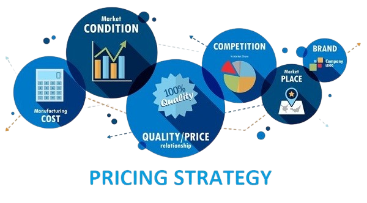

  

# Price Modeling in Data Science
**Price Modeling in Data Science** involves using statistical and machine learning techniques to predict or optimize prices based on various factors such as demand, competition, customer behavior, and market conditions. It helps businesses make data-driven pricing decisions to maximize revenue, profit, or market share.

### Key Aspects:
1. **Demand Forecasting:** Predict how changes in price affect demand.
2. **Elasticity Analysis:** Measure how sensitive demand is to price changes.
3. **Dynamic Pricing:** Implement algorithms to adjust prices in real-time based on market dynamics.
4. **Segmentation:** Customize pricing for different customer groups.
5. **Competitive Analysis:** Factor in competitor pricing strategies.
6. **Causal Inference:** Understand the impact of pricing changes on sales.

### Common Techniques:
- **Linear Regression**
- **Time Series Models (ARIMA, SARIMAX)**
- **Tree-Based Methods (Random Forest, XGBoost)**
- **Bayesian Methods**
- **Optimization Algorithms** (e.g., Linear Programming)

Price modeling is widely used in **e-commerce, retail, airlines, and hospitality** to stay competitive and adapt to changing market conditions.